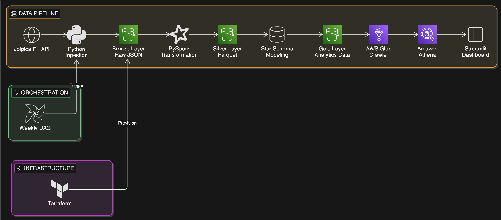

# 🏎️ F1ow — F1 Data Pipeline

F1ow is an automated end-to-end Formula 1 data pipeline that ingests, transforms, and analyzes race data using a medallion architecture on AWS, with an interactive Streamlit dashboard for analytics.

## 🏗️ Architecture


### 🎭 Medallion Architecture
- **Bronze Layer** — Raw F1 JSON data ingested from Jolpica REST API
- **Silver Layer** — Cleaned and transformed data in Parquet format using PySpark and Pandas
- **Gold Layer** — Aggregated business-ready metrics + Star Schema dimensional model

## 🛠️ Tech Stack
- 🐍 **Python** — API ingestion, transformation and aggregation scripts
- ☁️ **AWS S3** — Cloud storage for medallion architecture (Bronze/Silver/Gold layers)
- 🔍 **AWS Glue** — Data cataloging via Glue Crawler for schema discovery
- 📊 **Amazon Athena** — Serverless SQL querying directly on S3 data
- 📦 **Apache Parquet** — Columnar storage format for Silver and Gold layers
- ⚡ **Apache PySpark** — Distributed data transformation and star schema modeling
- 🌬️ **Apache Airflow** — Orchestrates weekly pipeline runs via DAGs
- 🏗️ **Terraform** — Provisions AWS infrastructure as code
- 🐳 **Docker** — Containerizes and runs Airflow locally
- 📈 **Streamlit** — Interactive F1 analytics dashboard
- 🐙 **GitHub** — Version control and project tracking

## 📁 Project Structure
```plaintext
F1ow/
├── airflow/                    # Airflow DAGs and Docker setup
│   ├── dags/
│   │   └── f1ow_dag.py         # Pipeline DAG with 5 tasks
│   └── docker-compose.yaml
├── src/                        # Python pipeline scripts
│   ├── fetch_f1_data.py        # Ingestion — API to Bronze S3
│   ├── transform_f1_data.py    # Transformation — Bronze to Silver (Pandas)
│   ├── aggregate_f1_data.py    # Aggregation — Silver to Gold
│   ├── spark_transform.py      # PySpark transformation — Bronze to Silver
│   └── star_schema.py          # Star schema modeling — Silver to Gold
├── dashboard/                  # Streamlit analytics dashboard
│   ├── app.py                  # Home page
│   └── pages/
│       ├── 1_Driver_Performance.py
│       ├── 2_Constructor_Performance.py
│       └── 3_Race_Results.py
├── terraform/                  # Infrastructure as code
│   └── main.tf
├── assets/                     # Project assets
│   └── architecture.png
└── README.md
```

## 🚀 Setup & Installation

### Prerequisites
- Python 3.8+
- Docker Desktop
- Terraform
- AWS Account with S3 and Glue access
- Java JDK (for PySpark)

### Steps
1. Clone the repository
```
git clone https://github.com/shams2808/F1ow.git
cd F1ow
```
2. Set up virtual environment
```
python -m venv venv
venv\Scripts\Activate
pip install -r requirements.txt
```
3. Configure AWS credentials
```
aws configure
```
4. Provision infrastructure
```
cd terraform
terraform init
terraform apply
```
5. Run the pipeline
```
python src/fetch_f1_data.py
python src/transform_f1_data.py
python src/aggregate_f1_data.py
python src/spark_transform.py
python src/star_schema.py
```
6. Start Airflow
```
cd airflow
docker-compose up
```
7. Access Airflow UI at `http://localhost:8080` and trigger `f1ow_pipeline`

8. Launch Dashboard
```
streamlit run dashboard/app.py
```

## 📊 Data Collected
- **Race Results** — All rounds for 2023, 2024 and 2025 seasons (70+ races)
- **Driver Standings** — Championship standings per season
- **Constructor Standings** — Team standings per season

## ⭐ Star Schema Model
```
fact_race_results
    ├── dim_driver
    ├── dim_constructor
    └── dim_race
```

## 🔍 Sample Athena Queries
```sql
-- Top drivers by wins in 2025
SELECT driver_name, total_wins, total_points
FROM driver_performance
WHERE season = 2025
ORDER BY total_wins DESC;

-- Verstappen performance across seasons
SELECT season, total_wins, total_points, podiums
FROM driver_performance
WHERE driverid = 'max_verstappen'
ORDER BY season;

-- All race winners across seasons
SELECT d.driver_name, r.race_name, r.country, r.season, f.points
FROM fact_race_results f
JOIN dim_driver d ON f.driver_id = d.driver_id
JOIN dim_race r ON f.season = r.season AND f.round = r.round
WHERE f.finish_position = 1
ORDER BY r.season, r.round;
```

## 🗺️ Roadmap
- [x] Phase 1 — Data ingestion pipeline with Airflow + AWS S3 + Terraform
- [x] Phase 2 — Medallion architecture + AWS Glue + Amazon Athena + Parquet
- [x] Phase 3 — PySpark transformations + star schema modeling
- [x] Phase 4 — Streamlit analytics dashboard